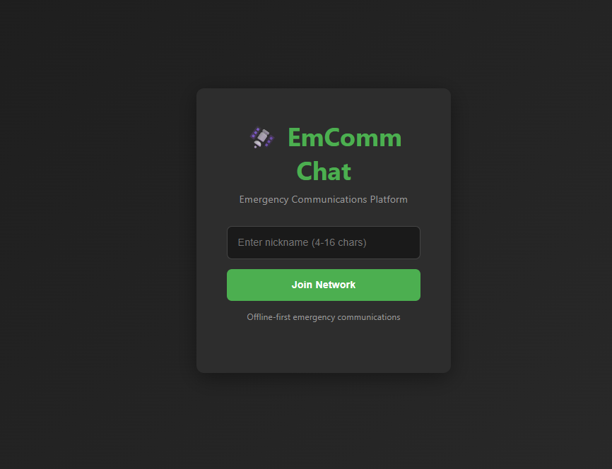
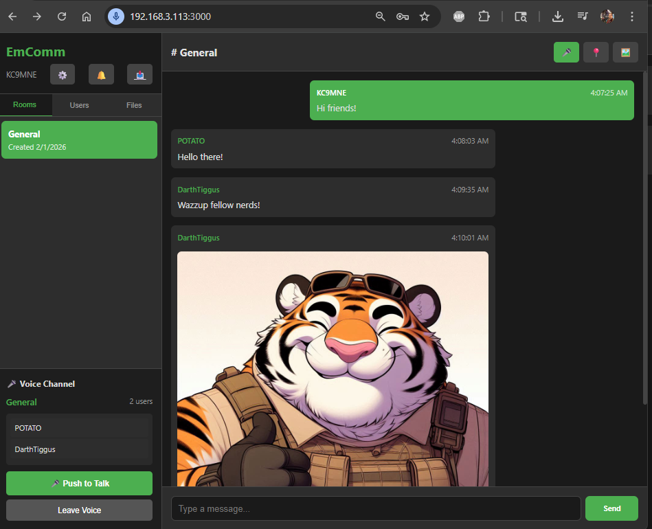
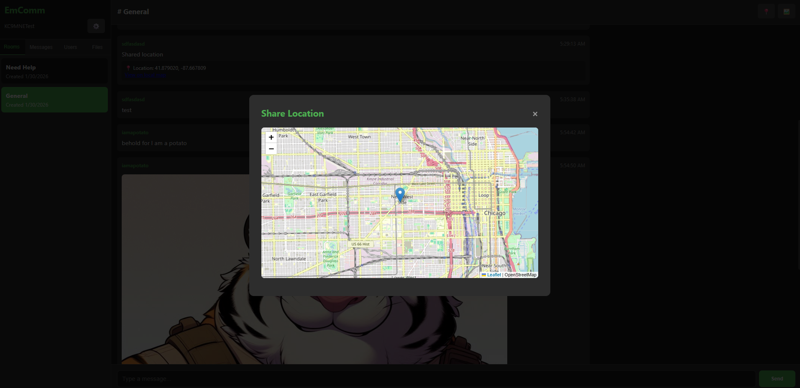

# EmComm Chat - Emergency Communications Platform

Offline-first emergency communications platform for text chat, voice/PTT, file sharing, and location tracking.

## Features

- 💬 **Real-time Chat**: Multiple chat rooms with persistent message history
- 🎤 **Voice/PTT**: WebRTC-based Push-to-Talk voice channels (Ham radio compliant - no encryption)
- 📍 **Location Sharing**: Share GPS coordinates with offline maps
- 🖼️ **Image Sharing**: Upload and share images inline in chat
- 📁 **File Sharing**: Upload and download files with web-based file browser
- 👥 **User Management**: Nickname-based identification with blocking capabilities
- 🔐 **Admin Controls**: Create/delete rooms, kick users, delete messages
- 🗑️ **Auto-Cleanup**: Configurable message retention (1-7 days)
- 🚫 **Content Filtering**: Built-in profanity filter
- 🗺️ **Offline Maps**: Support for locally-hosted map tiles
- 🖥️ **Desktop Apps**: Native Windows and Linux applications with built-in voice support

## Voice/PTT Features

✅ **Push-to-Talk** - Hold to transmit, release to listen  
✅ **Active Speaker Indicators** - See who's talking with visual feedback  
✅ **Channel Collision Detection** - PTT disabled when channel is busy  
✅ **Participant Lists** - Real-time list of users in voice channel   
✅ **Ham Radio Compliant** - No encryption, plain WebRTC audio  
✅ **Desktop & Browser Support** - Works on both platforms  

## Requirements

- Node.js 14+ (18+ recommended)
- 2GB RAM minimum
- 32GB storage (recommended for map tiles and uploads)
- Linux-based SBC (Raspberry Pi 4/5, Orange Pi, etc.) or any computer
- 🌐 **Offline Maps**: Support for locally-hosted map tiles

### Simple login with no external auth needed.

*Simple login screen lets users pick a name or enter a call sign*

### Simple Chat interface with image support, Admin created rooms basic file sharing, and direct messaging.

*Easy to use with core functions of modern messaging included.*

### Locations are shareable from device or manualy and can used predownloaded map tiles for 100% offline location services.

*Users can choose to share their location if they need help or help people locate eachother.*

## Quick Start

### 1. Installation

```bash
# Install Node.js if not already installed (on Debian/Ubuntu)
curl -fsSL https://deb.nodesource.com/setup_18.x | sudo -E bash -
sudo apt-get install -y nodejs

# Clone/download the project
cd EmcommChat

# Install dependencies
npm install
```

### 2. Configuration

Edit `config.js` to customize your deployment:

```javascript
module.exports = {
  server: {
    port: 3000,
    host: '0.0.0.0'  // Listen on all interfaces
  },
  
  admin: {
    username: 'admin',
    password: 'CHANGE_THIS_PASSWORD'  // ⚠️ CHANGE IMMEDIATELY
  },
  
  retention: {
    messageHistoryDays: 7,  // Keep messages for 7 days
  },
  
  // ... other settings
};
```

**IMPORTANT**: Change the default admin password before deployment!

### 3. Run the Server

```bash
# Start the server
npm start

# Or use a process manager (recommended for production)
npm install -g pm2
pm2 start server.js --name emcomm-chat
pm2 save
```

The server will start on `http://localhost:3000` (or your configured port).

### 4. Access the Interface

Open a web browser and navigate to:
- Local: `http://localhost:3000`
- Network: `http://YOUR_SERVER_IP:3000`

Users can connect from any device on your network.

## Voice/PTT Setup

### Desktop Apps (Recommended)

Desktop applications have built-in microphone access and don't require additional setup.

**Download and install:**
1. Navigate to `http://YOUR_SERVER_IP:3000/downloads.html`
2. Download for your platform:
   - Windows: `.exe` installer
   - Linux: `.AppImage` (make executable with `chmod +x`)
3. Run the application - it auto-connects to your server

**Building desktop apps yourself:**
```bash
cd desktop-app

# Install dependencies
npm install

# Build for your platform
npx electron-builder --win       # Windows
npx electron-builder --linux     # Linux AppImage
npx electron-builder --mac       # macOS

# Outputs will be in dist/ folder
```

### Browser Access

For voice/PTT in Chrome or Edge browsers:

1. Open Chrome or Edge
2. Navigate to: `chrome://flags/#unsafely-treat-insecure-origin-as-secure`
3. Add your server URL: `http://YOUR_SERVER_IP:3000`
4. Set to "Enabled"
5. Click "Relaunch" to restart browser
6. Navigate to your EmComm Chat server
7. Voice/PTT should now work!

**Note:** This setting only affects the specific URL you enter. Your browser remains secure for all other websites.

See `/public/downloads.html` for detailed step-by-step instructions with screenshots.

## Offline Map Setup

To enable offline maps, you need to download map tiles for your operating area.

### Option 1: Using QGIS and QMetaTiles

1. Install QGIS: https://qgis.org/
2. Install QMetaTiles plugin
3. Select your area of interest
4. Export tiles (zoom levels 1-15 recommended)
5. Copy tiles to `./map-tiles/` directory

### Option 2: Using Mobile Atlas Creator (MOBAC)

1. Download MOBAC: https://mobac.sourceforge.io/
2. Select "OSM Mapnik" as source
3. Select your region
4. Choose zoom levels 1-15
5. Export in "PNG tiles" format
6. Copy to `./map-tiles/{z}/{x}/{y}.png` structure

### Option 3: Tile Downloader Script

We've included a simple tile downloader (requires Python):

```bash
# Install dependencies
pip3 install requests pillow

# Download tiles for a bounding box
# Format: python3 download-tiles.py MIN_LAT MIN_LON MAX_LAT MAX_LON MIN_ZOOM MAX_ZOOM
python3 download-tiles.py 41.8 -87.7 41.9 -87.6 10 15

# Example: Chicago area
python3 download-tiles.py 41.6 -88.0 42.0 -87.5 1 14
```

**Storage Requirements:**
- Zoom 1-10: ~50MB
- Zoom 1-12: ~200MB
- Zoom 1-14: ~1GB
- Zoom 1-15: ~3-5GB (recommended for detailed local coverage)

## Deployment on SBC

### Systemd Service Setup

Create a systemd service for automatic startup:

```bash
# Create service file
sudo nano /etc/systemd/system/emcomm-chat.service
```

Add the following content:

```ini
[Unit]
Description=EmComm Chat Emergency Communications Platform
After=network.target

[Service]
Type=simple
User=YOUR_USERNAME
WorkingDirectory=/home/YOUR_USERNAME/EmcommChat
ExecStart=/usr/bin/node server.js
Restart=on-failure
RestartSec=10

[Install]
WantedBy=multi-user.target
```

Enable and start the service:

```bash
sudo systemctl enable emcomm-chat
sudo systemctl start emcomm-chat
sudo systemctl status emcomm-chat
```

### Using PM2 (Alternative)

```bash
# Install PM2 globally
npm install -g pm2

# Start application
pm2 start server.js --name emcomm-chat

# Setup PM2 to start on boot
pm2 startup
pm2 save

# Monitor
pm2 monit

# View logs
pm2 logs emcomm-chat
```

## Network Configuration

For emergency communications deployment:

### Local Network (WiFi Hotspot)

```bash
# Install hostapd and dnsmasq
sudo apt-get install hostapd dnsmasq

# Configure WiFi access point
# Edit /etc/hostapd/hostapd.conf

# Configure DHCP
# Edit /etc/dnsmasq.conf
```

### Static IP Configuration

```bash
# Edit network configuration
sudo nano /etc/dhcpcd.conf

# Add:
interface wlan0
static ip_address=192.168.10.1/24
static routers=192.168.10.1
```

### Firewall Rules

```bash
# Allow incoming connections on port 3000
sudo ufw allow 3000/tcp
sudo ufw enable
```

## Usage

### For Users

#### Text Chat
1. **Join Network**: Enter a nickname (8-16 characters)
2. **Select Room**: Click on a room in the Rooms tab
3. **Send Messages**: Type and press Enter or click Send
4. **Share Images**: Click the image icon (🖼️)
5. **Share Location**: Click the location icon (📍)
6. **Upload Files**: Go to Files tab, click Upload File

#### Voice/PTT
1. **Join Voice Channel**: Click "🎤 Push to Talk" in the sidebar
2. **Transmit**: Press and hold the PTT button while speaking
3. **Release**: Let go of the button to listen
4. **View Participants**: See who's in the voice channel below the PTT button
5. **Active Speakers**: Users currently talking show in green with 🔊 icon
6. **Leave Voice**: Click "Leave Voice" button when done

**PTT Tips:**
- 🟢 Green button = Ready to transmit
- 🔴 Red button = You're transmitting
- 🔴 Red disabled = Channel busy (someone else talking)
- Wait for green before transmitting!

### For Administrators

1. **Access Admin Panel**: Click the settings icon (⚙️)
2. **Login**: Use configured admin credentials
3. **Create Rooms**: Enter room name and click Create
4. **Kick Users**: Select user from dropdown and confirm
5. **Delete Messages**: (Currently done via database access)

## File Structure

```
EmcommChat/
├── server.js              # Main server application
├── database.js            # SQLite database layer
├── config.js              # Configuration file
├── package.json           # Node.js dependencies
├── public/                # Frontend files
│   ├── index.html         # Main HTML interface
│   ├── style.css          # Stylesheet
│   ├── app.js             # Client-side JavaScript
│   ├── voice.js           # Voice/PTT WebRTC handler
│   └── downloads.html     # Download page with setup instructions
├── desktop-app/           # Desktop application source
│   ├── main.js            # Electron main process
│   └── package.json       # Desktop app dependencies
├── data/                  # SQLite database (created automatically)
├── uploads/               # File uploads (created automatically)
│   └── images/            # Image uploads
├── map-tiles/             # Offline map tiles (you provide)
└── README.md              # This file
```

## Maintenance

### View Logs

```bash
# If using PM2
pm2 logs emcomm-chat

# If using systemd
sudo journalctl -u emcomm-chat -f
```

### Database Backup

```bash
# Backup database
cp data/emcomm.db data/emcomm-backup-$(date +%Y%m%d).db

# Backup uploads
tar -czf uploads-backup-$(date +%Y%m%d).tar.gz uploads/
```

### Manual Cleanup

```bash
# Clean old messages (older than 7 days)
sqlite3 data/emcomm.db "DELETE FROM messages WHERE created_at < datetime('now', '-7 days');"

# Clean old files
find uploads/ -type f -mtime +7 -delete
```

### Disk Space Monitoring

```bash
# Check disk usage
df -h

# Check upload directory size
du -sh uploads/

# Check database size
du -sh data/
```

## Troubleshooting

### Cannot Connect to Server

1. Check if server is running: `sudo systemctl status emcomm-chat`
2. Check firewall: `sudo ufw status`
3. Verify port is not in use: `sudo netstat -tulpn | grep 3000`
4. Check logs for errors

### Voice/PTT Not Working

**In Browser:**
1. Verify Chrome flags are set correctly (see Voice/PTT Setup above)
2. Check microphone permissions in browser
3. Open browser console (F12) and look for errors
4. Verify server is accessible over HTTP (not HTTPS)

**In Desktop App:**
1. Check system microphone permissions
2. Verify app can connect to server
3. Try closing and reopening the app
4. Check Task Manager - ensure only one instance is running

**Common Issues:**
- **"Unknown" on PTT button**: Participant list not loading - refresh page
- **Red disabled button**: Someone else is talking - wait for them to finish
- **Can hear myself**: Should not happen - report as bug if it does
- **No participant list**: Check browser console for errors

### Desktop App Won't Close

**Windows:**
1. Open Task Manager (Ctrl+Shift+Esc)
2. Find "EmComm Chat" process
3. Right-click → End Task

**Linux:**
```bash
pkill -f emcomm-chat
```

This issue is fixed in v2.0.0+ of the desktop apps.

### Map Tiles Not Loading

1. Verify tiles exist in `./map-tiles/` directory
2. Check tile structure: `{z}/{x}/{y}.png`
3. Verify file permissions: `chmod -R 755 map-tiles/`
4. Check browser console for tile load errors

### File Upload Fails

1. Check disk space: `df -h`
2. Verify upload directory permissions: `chmod -R 755 uploads/`
3. Check file size limits in `config.js`
4. Review server logs for errors

### High Memory Usage

1. Reduce message retention days in `config.js`
2. Run manual cleanup
3. Limit max concurrent connections
4. Increase SBC swap space

## Security Considerations

⚠️ **Important**: This application is designed for offline emergency use and does not include:

- User authentication (beyond nicknames)
- Message encryption
- HTTPS/TLS (add nginx reverse proxy if needed)
- Protection against malicious users on the network

**Voice/PTT Security:**
- Audio is transmitted in plain WebRTC (no encryption)
- Compliant with Ham radio regulations (no encryption allowed)
- Anyone on the network can join voice channels
- No user verification before transmitting

For deployment scenarios where security is critical:

1. **Change admin password immediately**
2. **Use behind a firewall** - only allow trusted network access
3. **Consider adding nginx reverse proxy** with basic auth
4. **Regularly backup the database**
5. **Monitor for abuse** using admin controls
6. **Restrict physical network access** - trusted users only

## Performance Tuning

For better performance on resource-constrained SBCs:

```javascript
// In config.js
retention: {
  messageHistoryDays: 1,  // Reduce to 24 hours
  cleanupIntervalHours: 3  // More frequent cleanup
},

uploads: {
  maxFileSize: 5 * 1024 * 1024,  // Reduce max file size
}
```

Consider using:
- SQLite write-ahead logging (WAL mode)
- Nginx as reverse proxy for static file serving
- PM2 for process management and auto-restart

## Recent Updates (v2.0 - February 2025)

### 🎤 Voice/PTT System - PRODUCTION READY!
- ✅ Fixed critical voiceRooms scope bug (was recreated per connection)
- ✅ Participant lists now working correctly
- ✅ PTT shows real usernames instead of "Unknown"
- ✅ Active speaker indicators with green pulsing animation
- ✅ Channel collision detection prevents talking over others
- ✅ No audio loopback (you won't hear yourself)
- ✅ Desktop apps with proper exit handling (no lingering processes)
- ✅ Professional downloads page with Chrome setup instructions

### 🧹 UI Cleanup
- ✅ Removed unused "Messages" tab from sidebar
- ✅ Cleaner interface focused on essential features
- ✅ Responsive voice panel for desktop and mobile

### 🖥️ Desktop Applications
- ✅ Windows and Linux builds available
- ✅ Built-in HTTP microphone access (no Chrome flags needed)
- ✅ Proper process cleanup on exit
- ✅ Single instance lock prevents multiple processes
- ✅ Auto-connects to configured server

## Known Limitations

- **Mobile WebView**: Voice/PTT does not work in mobile app WebView (Android/iOS)
- **macOS Desktop App**: Must be built on a Mac (cross-compilation not supported)
- **Firefox/Safari**: Limited voice support - Chrome/Edge recommended
- **HTTPS Required for Mobile**: Mobile browsers require HTTPS for microphone access (desktop apps bypass this)

## Contributing

This is a purpose-built emergency communications tool. Contributions welcome for:

- Bug fixes
- Performance improvements
- Additional offline features
- Better map tile management
- Enhanced admin controls
- Voice system improvements

## License

MIT License - Use freely for emergency communications

## Support

For issues or questions:
1. Check the troubleshooting section
2. Review server logs
3. Check `/public/downloads.html` for voice setup
4. Open an issue on GitHub

## Credits

Built for emergency communications scenarios where traditional infrastructure may be unavailable.

Uses:
- Socket.io for real-time communication
- WebRTC for voice/PTT channels
- Leaflet.js for mapping
- SQLite for data storage
- Express.js for web server
- Electron for desktop applications

---

